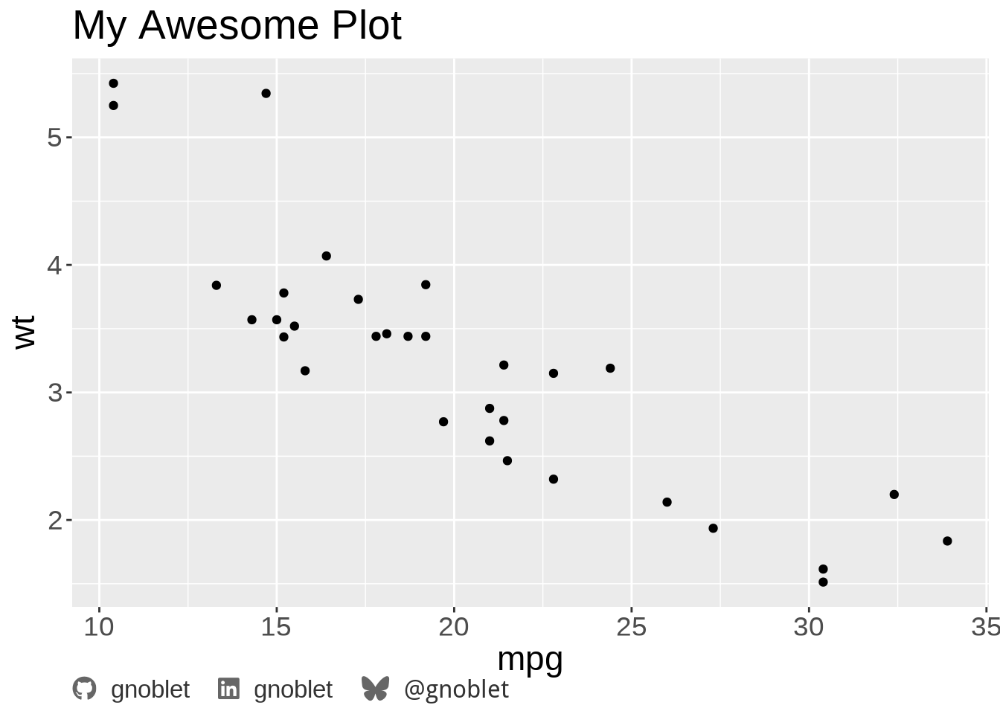
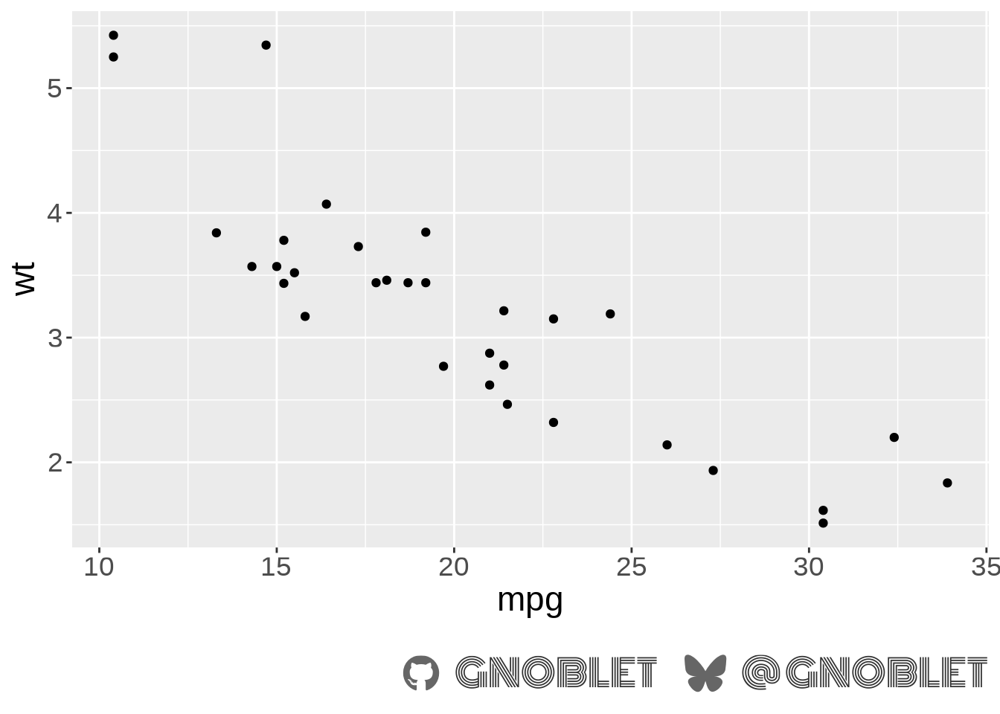
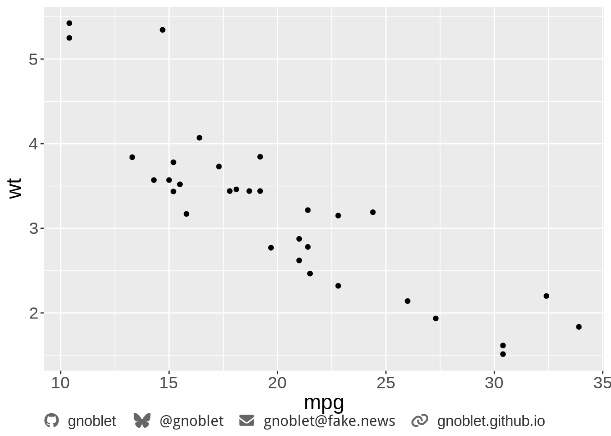
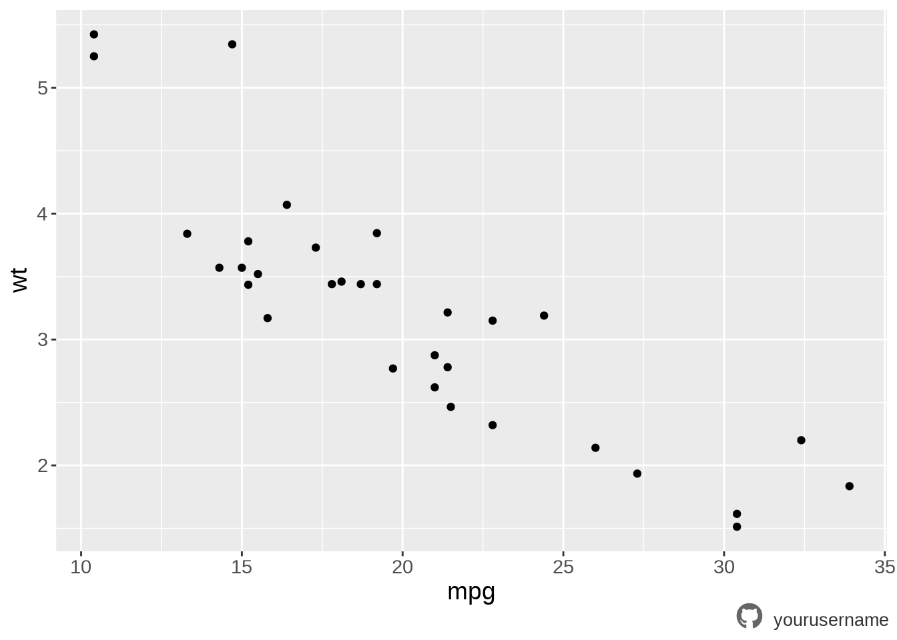
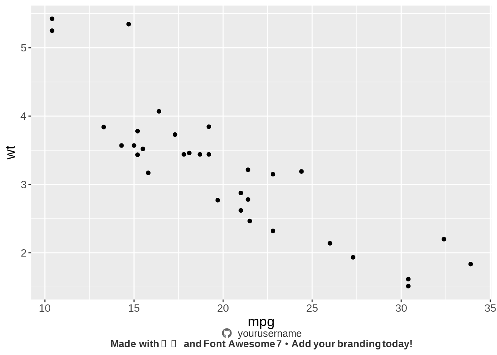
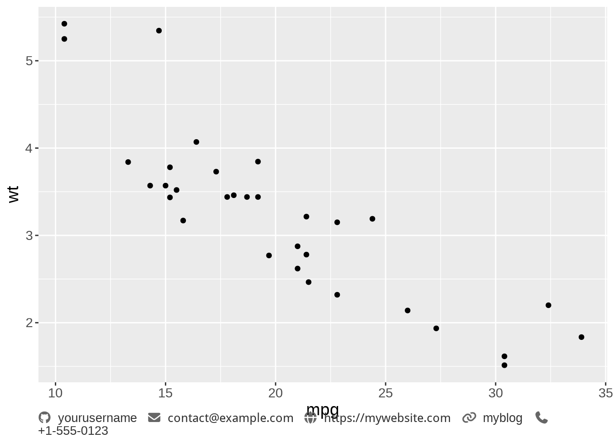

<!-- README.md is generated from README.Rmd. Please edit that file -->

# ggbranding

<!-- badges: start -->

[](https://github.com/yourusername/ggbranding/actions)
[](https://CRAN.R-project.org/package=ggbranding)
<!-- badges: end -->

> Add personal branding to ggplot2 charts using Font Awesome 7 icons

**Key Features:**

- 🚀 **Auto Font Setup** - Automatically downloads Font Awesome 7 fonts
  on first use
- 🎨 **500+ Icons** - Access to all Font Awesome brand and communication
  icons
- 🎯 **One Function Call** - Add complete branding with `add_branding()`
- 🎨 **Customizable** - Brand colors, custom text, and styling options
- 📦 **Lightweight** - Efficient font caching and minimal dependencies

## Installation

Install the development version from GitHub:

``` r
# library(pak)
pak::pak("gnoblet/ggbranding")
# CRAN version to come
```

## Quick Start

``` r
library(ggplot2)
library(ggtext)
library(ggbranding)
library(showtext)
#> Loading required package: sysfonts
#> Loading required package: showtextdb

# setup dpi
showtext::showtext_opts(dpi = 240)

# Add branding with + in ggplot chain
ggplot(mtcars, aes(x = mpg, y = wt)) +
  geom_point() +
  labs(title = "My Awesome Plot") +
  add_branding(
    github = "yourusername",
    linkedin = "yourprofile"
  )
```



That’s it! The function automatically:

- Downloads and sets up Font Awesome 7 fonts
- Applies `ggtext::element_textbox_simple()` theme
- Creates HTML-formatted captions with icons
- Handles text sanitization for grid rendering

## Core Functions

### `add_branding()` - Complete Branding Solution

Use with `+` in your ggplot chain:

``` r
# Basic usage with +
ggplot(mtcars, aes(x = mpg, y = wt)) +
  geom_point() +
  add_branding(
    github = "yourusername",
    linkedin = "yourprofile"
  )
```


``` r

# With additional text before branding
ggplot(iris, aes(x = Sepal.Length, y = Sepal.Width)) +
  geom_point() +
  add_branding(
    github = "yourusername",
    additional_text = "Data source: iris dataset",
    text_position = "before",
    line_spacing = 2L, # double line breaks for extra space
    icon_color = "steelblue",
    text_color = "steelblue"
  )
```



``` r

# With additional text after branding
ggplot(mtcars, aes(x = mpg, y = wt)) +
  geom_point() +
  add_branding(
    github = "yourusername",
    additional_text = "Data source: mtcars dataset",
    text_position = "after"
  )
```



``` r

# With custom styling
ggplot(mtcars, aes(x = mpg, y = wt)) +
  geom_point() +
  add_branding(
    github = "yourusername",
    use_brand_colors = TRUE,
    caption_halign = 1, # right-align caption
    icon_size = "12pt", # larger icons
    text_size = "8pt" # smaller text
  )
```



``` r

# With package branding
ggplot(mtcars, aes(x = mpg, y = wt)) +
  geom_point() +
  add_branding(
    github = "yourusername",
    additional_text = "**Made with ❤️ and Font Awesome 7 • Add your branding today!**",
    text_position = "after",
    caption_halign = 0.5
  )
```



## Supported Platforms

Built-in support for major platforms:

``` r
# Built-in platforms
platforms <- c(
  "github",
  "gitlab",
  "linkedin",
  "bluesky",
  "twitter",
  "mastodon",
  "orcid",
  "email",
  "website"
)
```

| Platform  | Parameter  | Example                         |
|-----------|------------|---------------------------------|
| GitHub    | `github`   | `github = "username"`           |
| GitLab    | `gitlab`   | `gitlab = "username"`           |
| LinkedIn  | `linkedin` | `linkedin = "profile"`          |
| Bluesky   | `bluesky`  | `bluesky = "user.bsky.social"`  |
| Twitter/X | `twitter`  | `twitter = "handle"`            |
| Mastodon  | `mastodon` | `mastodon = "@user@server.com"` |
| ORCID     | `orcid`    | `orcid = "0000-0000-0000-0000"` |
| Email     | `email`    | `email = "user@email.com"`      |
| Website   | `website`  | `website = "yoursite.com"`      |

## Custom Icons

Access 500+ Font Awesome icons with `custom_icons`:

``` r
# Discover available icons
list_available_icons() |> head(5)
#> ℹ Showing all 543 available icons
#> • Use the 'name' column values in custom_icons parameter
#>              name           label
#> 1        42_group        42 Group
#> 2           500px           500px
#> 3 accessible_icon Accessible Icon
#> 4        accusoft        Accusoft
#> 5             adn             Adn
#>                                                           search_terms
#> 1                                                                     
#> 2                                                                     
#> 3 accessibility,disabled,handicap,person,uer,wheelchair,wheelchair-alt
#> 4                                                                     
#> 5

# Search for specific icons
list_available_icons(search = "envelope")
#> ℹ Found 3 icon(s) matching: envelope
#>                    name                 label
#> 1              envelope              Envelope
#> 2 envelope_circle_check Envelope Circle Check
#> 3        envelopes_bulk        Envelopes Bulk
#>                                                                                       search_terms
#> 1 Back of Envelope,e-mail,email,envelope,letter,mail,message,newsletter,notification,offer,support
#> 2                 check,email,enable,envelope,mail,not affected,ok,okay,read,sent,validate,working
#> 3             archive,envelope,letter,newsletter,offer,post office,postal,postcard,send,stamp,usps
list_available_icons(search = "phone")
#> ℹ Found 7 icon(s) matching: phone
#>             name          label
#> 1    comment_sms    Comment Sms
#> 2         mobile         Mobile
#> 3   mobile_retro   Mobile Retro
#> 4 mobile_vibrate Mobile Vibrate
#> 5          phone          Phone
#> 6         signal         Signal
#> 7      voicemail      Voicemail
#>                                                                                                          search_terms
#> 1                                              answer,chat,conversation,message,mobile,notification,phone,sms,texting
#> 2                          android,call,cell,cell phone,device,mobile,mobile phone,number,phone,screen,telephone,text
#> 3                                                                                            cellphone,cellular,phone
#> 4      android,call,cell,cell phone,device,haptic,mobile,mobile phone,notification,number,phone,screen,telephone,text
#> 5 Left Hand Telephone Receiver,call,earphone,number,phone,receiver,support,talking,telephone,telephone receiver,voice
#> 6                                       antenna,antenna bars,bar,bars,cell,graph,mobile,online,phone,reception,status
#> 7                                                                                          answer,inbox,message,phone
list_available_icons(search = "rss")
#> ! No icons found matching search term: rss
#> ℹ Try a different search term or use list_available_icons() to see all icons
#> data frame with 0 columns and 0 rows

# Use custom icons
ggplot(mtcars, aes(x = mpg, y = wt)) +
  geom_point() +
  add_branding(
    github = "yourusername",
    custom_icons = c(
      envelope = "contact@example.com",
      globe = "https://mywebsite.com",
      rss = "myblog",
      phone = "+1-555-0123"
    )
  )
#> No icon found for platform 'rss', using generic link icon with following
#> unicode: 'xf0c1'.
```



## Advanced Examples

### Publication-Ready Plot

``` r
library(dplyr)
#> 
#> Attaching package: 'dplyr'
#> The following objects are masked from 'package:stats':
#> 
#>     filter, lag
#> The following objects are masked from 'package:base':
#> 
#>     intersect, setdiff, setequal, union

# Create a complete publication plot
mtcars |>
  ggplot(aes(x = mpg, y = wt, color = factor(cyl))) +
  geom_point(size = 3, alpha = 0.8) +
  geom_smooth(method = "lm", se = FALSE, linetype = "dashed") +
  scale_color_viridis_d(name = "Cylinders") +
  labs(
    title = "Car Weight vs Fuel Efficiency",
    subtitle = "Motor Trend Car Road Tests (1974)",
    x = "Miles per Gallon",
    y = "Weight (1000 lbs)"
  ) +
  theme_minimal() +
  theme(
    plot.title = element_text(size = 16, face = "bold"),
    plot.subtitle = element_text(size = 12, color = "grey60"),
    legend.position = "bottom"
  ) +
  add_branding(
    github = "yourusername",
    orcid = "0000-0000-0000-0000",
    additional_text = "Data: Motor Trend Car Road Tests (1974)",
    use_brand_colors = TRUE,
    caption_halign = 0.5, # center-align
    icon_size = "12pt",
    text_size = "10pt"
  )
#> `geom_smooth()` using formula = 'y ~ x'
```


### With Communication Icons

``` r
# Academic/professional branding
ggplot(mtcars, aes(x = mpg, y = wt)) +
  geom_point() +
  add_branding(
    github = "yourusername",
    orcid = "0000-0000-0000-0000",
    custom_icons = c(
      envelope = "researcher@university.edu",
      globe = "https://researcher.university.edu",
      phone = "+1-555-RESEARCH"
    ),
    additional_text = "University Research Lab",
    text_position = "before",
    use_brand_colors = TRUE,
    icon_size = "10pt",
    text_size = "9pt"
  )
```

### Tech Project Branding

``` r
# Developer/tech project branding
ggplot(tech_data, aes(x = metric, y = value)) +
  geom_bar(stat = "identity") +
  add_branding(
    github = "yourproject",
    custom_icons = c(
      link = "https://project-docs.com",
      rss = "project-blog"
    ),
    additional_text = "Open Source Project • MIT License",
    separator = " | ",
    icon_color = "#2E3440",
    text_color = "#5E81AC"
  )
```

### Corporate Branding

``` r
# Company/corporate branding
ggplot(mpg, aes(x = class)) +
  geom_col() +
  add_branding(
    linkedin = "company-profile",
    website = "company.com",
    custom_icons = c(
      envelope = "info@company.com",
      phone = "+1-800-COMPANY"
    ),
    additional_text = "© 2024 Company Name • All Rights Reserved",
    text_position = "after",
    caption_halign = 1, # right-align for corporate look
    icon_size = "7pt",
    text_size = "7pt"
  )
```

## Font Management

The package handles fonts automatically, but you can control the
process:

``` r
# Check if fonts are properly loaded
fa_setup()

# Download fonts manually if needed
fa_download(version = "7.0.1")

# Clear font cache
clear_font_cache_dir()

# Get font cache location
get_font_cache_dir()
```

## Styling Options

### Caption Alignment

``` r
# Left-aligned (default)
ggplot(data, aes(x, y)) +
  geom_point() +
  add_branding(github = "username", caption_halign = 0)

# Center-aligned
ggplot(data, aes(x, y)) +
  geom_point() +
  add_branding(github = "username", caption_halign = 0.5)

# Right-aligned
ggplot(data, aes(x, y)) +
  geom_point() +
  add_branding(github = "username", caption_halign = 1)
```

### Brand Colors

``` r
# Use official brand colors
ggplot(data, aes(x, y)) +
  geom_point() +
  add_branding(
    github = "username",
    linkedin = "profile",
    use_brand_colors = TRUE
  )

# Custom colors
ggplot(data, aes(x, y)) +
  geom_point() +
  add_branding(
    github = "username",
    icon_color = "#FF6B6B",
    text_color = "#4ECDC4"
  )
```

### Text Formatting

``` r
# Custom separators and sizing
ggplot(data, aes(x, y)) +
  geom_point() +
  add_branding(
    github = "username",
    linkedin = "profile",
    separator = " • ",
    icon_size = "12pt", # larger icons
    text_size = "9pt" # smaller text
  )

# Different icon and text sizes
ggplot(data, aes(x, y)) +
  geom_point() +
  add_branding(
    github = "username",
    icon_size = "14pt", # big icons
    text_size = "7pt" # small text
  )

# Custom separator styling
ggplot(data, aes(x, y)) +
  geom_point() +
  add_branding(
    github = "username",
    linkedin = "profile",
    separator = " ◆ ",
    separator_size = "6pt", # smaller separator
    separator_color = "#999999" # lighter separator
  )

# Line height adjustment
ggplot(data, aes(x, y)) +
  geom_point() +
  add_branding(
    github = "username",
    additional_text = "Data source: Multiple lines of text",
    line_height = "1.5", # more spacing between lines
    text_position = "before"
  )

# With width constraints
ggplot(data, aes(x, y)) +
  geom_point() +
  add_branding(
    github = "username",
    caption_width = "80%",
    caption_margin = margin(t = 10, r = 5, b = 5, l = 5)
  )

# Complete styling example
ggplot(data, aes(x, y)) +
  geom_point() +
  add_branding(
    github = "username",
    linkedin = "profile",
    custom_icons = c(envelope = "contact@email.com"),
    additional_text = "Custom styled branding example",
    text_position = "before",
    separator = " ◆ ",
    separator_size = "10pt",
    separator_color = "#666666",
    icon_size = "12pt",
    text_size = "8pt",
    line_height = "1.4",
    icon_color = "#2E3440",
    text_color = "#5E81AC",
    caption_halign = 0.5
  )
```

## Real-World Use Cases

### Research Paper Figures

``` r
# For academic publications
mtcars |>
  ggplot(aes(x = factor(cyl), y = mpg)) +
  geom_boxplot() +
  labs(
    title = "Figure 1: Treatment Effects on Response Variable",
    subtitle = "n = 120, p < 0.001"
  ) +
  add_branding(
    orcid = "0000-0000-0000-0000",
    github = "research-lab",
    additional_text = "Data: Clinical Trial 2024 • IRB #2024-001",
    text_position = "before",
    icon_size = "9pt",
    text_size = "8pt",
    caption_halign = 0
  )
```

### Data Science Portfolio

``` r
# For portfolio projects
portfolio_plot <- economics |>
  ggplot(aes(x = date, y = unemploy)) +
  geom_line() +
  labs(
    title = "US Unemployment Over Time",
    subtitle = "Economic data analysis"
  ) +
  add_branding(
    github = "data-scientist",
    linkedin = "data-scientist-profile",
    custom_icons = c(
      globe = "portfolio-website.com"
    ),
    additional_text = "Data Science Portfolio Project",
    use_brand_colors = TRUE,
    caption_halign = 0.5
  )
```

### Business Reports

``` r
# For business/consulting reports
quarterly_report <- sales_data |>
  ggplot(aes(x = quarter, y = revenue, fill = region)) +
  geom_col(position = "dodge") +
  labs(
    title = "Q4 2024 Revenue by Region",
    subtitle = "Year-over-year growth: +15%"
  ) +
  add_branding(
    linkedin = "consulting-firm",
    website = "consulting-firm.com",
    custom_icons = c(
      envelope = "contact@consulting-firm.com"
    ),
    additional_text = "Confidential • Client Report",
    text_position = "after",
    caption_halign = 1
  )
```

## Troubleshooting

### Common Issues

``` r
# 1. Icons not displaying
fa_setup(auto_download = TRUE)
#> ✔ Font Awesome 7 fonts are already loaded (Brands and Free Solid)
#> [1] TRUE

# 2. Clear cache if fonts seem corrupted
clear_font_cache_dir(confirm = FALSE)
#> Font cache cleared successfully.
#> [1] TRUE

# 3. Check available icons
head(list_available_icons())
#> ℹ Showing all 543 available icons
#> • Use the 'name' column values in custom_icons parameter
#>              name           label
#> 1        42_group        42 Group
#> 2           500px           500px
#> 3 accessible_icon Accessible Icon
#> 4        accusoft        Accusoft
#> 5             adn             Adn
#> 6        adversal        Adversal
#>                                                           search_terms
#> 1                                                                     
#> 2                                                                     
#> 3 accessibility,disabled,handicap,person,uer,wheelchair,wheelchair-alt
#> 4                                                                     
#> 5                                                                     
#> 6

# 4. Test basic functionality
branding(github = "test")
#> [1] "<span style='font-family:\"Font Awesome 7 Brands\"; color: #666666; font-size: 8pt;'>&#xf09b;</span> <span style='color: #333333; font-size: 8pt; line-height: 1.2;'>test</span>"
```

### Manual Font Setup (If Needed)

``` r
library(sysfonts)
library(showtext)

# Download Font Awesome 7 from https://fontawesome.com/download
# Extract and use the Brands font file
sysfonts::font_add(
  family = "Font Awesome 7 Brands",
  regular = "path/to/Font-Awesome-7-Brands-Regular-400.otf"
)
showtext::showtext_auto()

# Then use with setup_fonts = FALSE
branding(github = "username", setup_fonts = FALSE)
```

## Dependencies

- `ggplot2` - Plot creation
- `ggtext` - HTML text rendering
- `glue` - String formatting
- `sysfonts` - Font loading
- `showtext` - Font rendering
- `httr2` - Font downloading
- `checkmate` - Parameter validation
- `purrr` - Functional programming
- `fs` - File system operations

## Contributing

Contributions welcome! Priority areas:

1.  **New Icons**: Add support for additional platforms
2.  **Layouts**: New caption layout options
3.  **Styling**: Enhanced visual customization
4.  **Documentation**: More examples and use cases

``` r
# To add a new platform, update the branding() function
# and add corresponding icons to icons_df dataset
```

## License

MIT License - see [LICENSE](LICENSE) file.

## Citation

``` r
# Will be available when package is complete
citation("ggbranding")
```

## Acknowledgments

- Inspired by [Nicola Rennie’s blog
  post](https://nrennie.rbind.io/blog/adding-social-media-icons-ggplot2/)
- Font Awesome team for excellent iconography
- R community for ggplot2, ggtext, and ecosystem packages

------------------------------------------------------------------------

**Made with ♥ and Font Awesome 7 • Add your branding today!**
